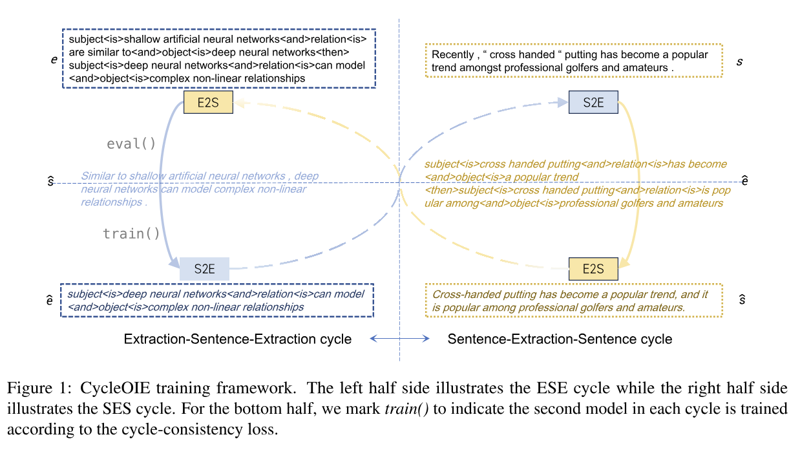

# CycleOIE

This is the official repository for COLING 2025 paper 
_**CycleOIE: A Low-Resource Training Framework For Open Information Extraction**_

## Environment
    conda create -n cycleoie python=3.10
    conda activate cycleoie
    pip install torch==2.1
    pip install transformers
    pip install openai

## Re-annotation with gpt
    cd ./llm_annotate 

Instruct gpt with openie annotation principles

    python principles.py 

Instruct gpt with few-shot examples, formatted into multi-turn chat

    python examples.py  

## Train CycleOIE with processed dataset.

    cd ../
    python cycle_train_t5.py

## Process dataset. 

(Our designed formulation for extractions.)

We use three additional tokens to split each part of an extraction. For example,

Sentence: 

    The track was in excellent condition , running through the trees .

Extraction:

    The track | was in | excellent condition
    The track | was running through | the trees

We formulate it into a sequence:

    subject <is> The track <and> relation <is> was in <and> object <is> excellent condition <then> subject <is> The track <and> relation <is> was running through <and> object <is> the trees

